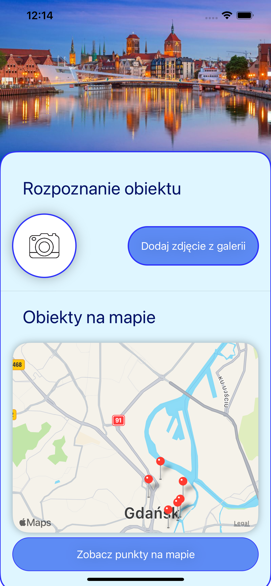
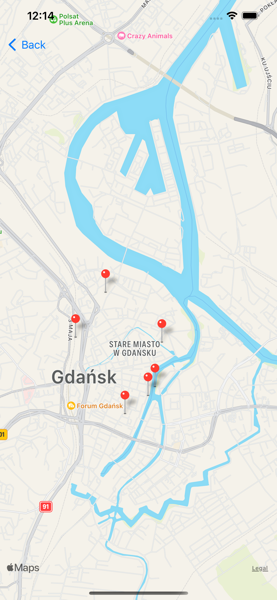
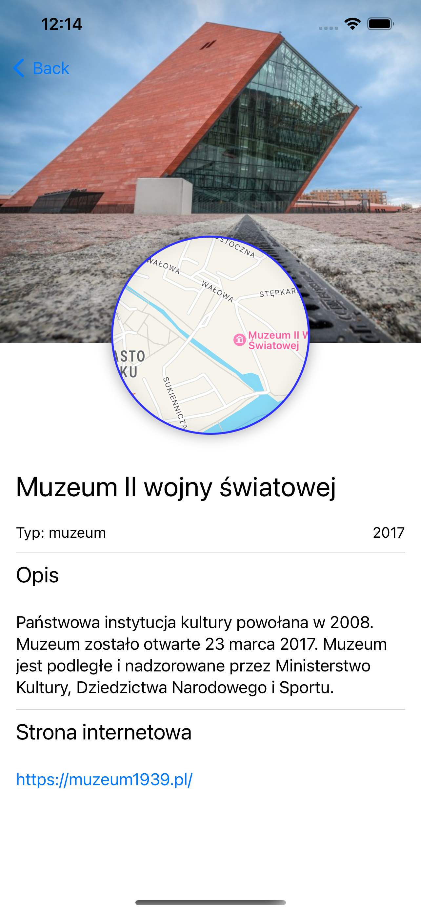

<div id="top"></div>

<!-- PROJECT SHIELDS -->
[![LinkedIn][linkedin-shield]][linkedin-url]

<!-- PROJECT LOGO -->
<br />
<div align="center">
  <a href="https://github.com/lukaszgolojuch/Colorful-Calculator">
    
  </a>

  <h3 align="center">Colorful Calculator</h3>

  <p align="center">
    SwiftUI iOS application that uses AI to recognize historical buildings and museums of Gdańsk. 
    <br />
  </p>
</div>

<!-- TABLE OF CONTENTS -->
<details>
  <summary>Table of Contents</summary>
  <ol>
    <li>
      <a href="#about-the-project">About The Project</a>
      <ul>
        <li><a href="#built-with">Built With</a></li>
      </ul>
    </li>
    <li>
      <a href="#getting-started">Getting Started</a>
      <ul>
        <li><a href="#prerequisites">Prerequisites</a></li>
      </ul>
    </li>
    <li><a href="#usage">Usage</a></li>
    <li><a href="#contributing">Contributing</a></li>
    <li><a href="#contact">Contact</a></li>
  </ol>
</details>


<!-- ABOUT THE PROJECT -->
## About The Project






To build this project has been used SwiftUI, Swift and CoreML to create this amazing application.

Main features:
* Created CoreML model for building from images recognition 
* Created JSON file for storing informations about buildings
* MapKit has been used for graphical representation of places on the map

<p align="right">(<a href="#top">back to top</a>)</p>

### Built With

To build this application this technologies has been used:

* Swift 5
* XCode 13
* SwiftUI 3
* CoreML
* MapKit
* JSON

Application has been tested on: 
* iOS 15.4
* iOS 15.3
* iOS 15.2

<p align="right">(<a href="#top">back to top</a>)</p>

<!-- GETTING STARTED -->
## Getting Started

To get your own copy of this app type:

* via SSH
	```sh
	git@github.com:lukaszgolojuch/Gdansk-Tour.git
	```
* via HTTPS
	```sh
	https://github.com/lukaszgolojuch/Gdansk-Tour.git
	```
* via GitHub CLI
	```sh
	gh repo clone lukaszgolojuch/Gdansk-Tour
	```
  
<!-- CONTRIBUTING -->
## Contributing

Contributions are what make the open source community such an amazing place to learn, inspire, and create. Any contributions you make are **greatly appreciated**.

If you have a suggestion that would make this better, please fork the repo and create a pull request. You can also simply open an issue with the tag "enhancement".
Don't forget to give the project a star! Thanks again!

1. Fork the Project
2. Create your Feature Branch (`git checkout -b feature/AmazingFeature`)
3. Commit your Changes (`git commit -m 'Add some AmazingFeature'`)
4. Push to the Branch (`git push origin feature/AmazingFeature`)
5. Open a Pull Request

<p align="right">(<a href="#top">back to top</a>)</p>


<!-- LICENSE -->
## License

Distributed under the MIT License. 

<p align="right">(<a href="#top">back to top</a>)</p>


<!-- CONTACT -->
## Contact

Łukasz Gołojuch - lukasz.golojuch@gmail.com

Project Link: [https://github.com/lukaszgolojuch/Colorful-Calculator](https://github.com/lukaszgolojuch/Colorful-Calculator)

<p align="right">(<a href="#top">back to top</a>)</p>


<!-- MARKDOWN LINKS & IMAGES -->
[linkedin-shield]: https://img.shields.io/badge/-LinkedIn-black.svg?style=for-the-badge&logo=linkedin&colorB=555
[linkedin-url]: https://www.linkedin.com/in/lukasz-golojuch/
